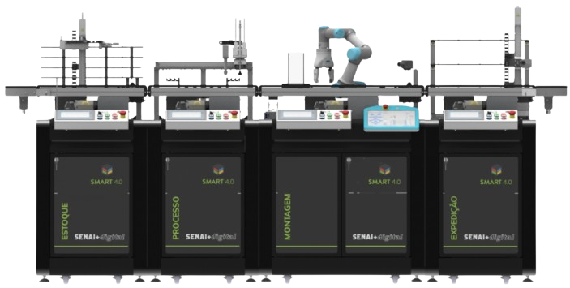

<div align="center">
  
</div>
<div align="center">
  <h1>Bancada Smart 4.0 — Sistema de Gerenciamento</h1>
</div>

Projeto de conclusão do 3º semestre do Curso Técnico em Desenvolvimento de Sistemas do SENAI. A aplicação integra software e hardware para supervisionar e controlar a **Bancada Smart 40**, uma linha de produção didática composta por quatro estações automatizadas.

---

## 📋 Sobre o Projeto

A Bancada Smart simula um ambiente de manufatura industrial com quatro estações encadeadas:

| Estação | Função |
|---|---|
| **Estoque** | Armazenamento e gestão das peças disponíveis para produção |
| **Processo** | Etapa de processamento das peças |
| **Montagem** | Montagem dos componentes do produto final |
| **Expedição** | Saída e rastreamento dos pedidos concluídos |

O sistema se comunica diretamente com os **CLPs Siemens** de cada estação via protocolo **S7**, permitindo leitura e escrita de tags em tempo real sem necessidade de softwares intermediários (como o TIA Portal aberto).

---

## 🛠️ Tecnologias Utilizadas

**Backend**
- Java 17
- Spring Boot 4.x (Web MVC, Data JPA, Validation, Thymeleaf)
- MySQL 8
- Lombok
- Protocolo S7 (implementação própria via TCP/IP)

**Frontend**
- React 19 + TypeScript
- Vite 8
- Tailwind CSS 4
- React Router DOM 7
- Three.js / React Three Fiber (visualização 3D)

---

## 📁 Estrutura do Repositório

```
planta-smart-4.0/
├── backend/
│   └── planta-smart-4.0/        # Aplicação Spring Boot
│       ├── src/
│       │   ├── main/java/com/smart/appsa/
│       │   │   ├── clpcomm/     # Comunicação S7 com CLPs Siemens
│       │   │   ├── controller/  # Endpoints REST
│       │   │   ├── service/     # Regras de negócio
│       │   │   ├── model/       # Entidades JPA
│       │   │   ├── repository/  # Acesso a dados
│       │   │   ├── dto/         # Objetos de transferência
│       │   │   ├── mapper/      # Conversão entre camadas
│       │   │   ├── exception/   # Exceções de domínio
│       │   │   └── config/      # Configurações e inicialização
│       │   └── resources/
│       │       ├── application.properties
│       │       ├── script.sql   # Script de criação do banco
│       │       └── static/      # Assets servidos pelo Spring
│       └── pom.xml
│
└── frontend/
    └── planta-smart-4.0/        # Aplicação React + TypeScript
        ├── src/
        │   ├── domain/          # Entidades, enums, repositórios (interfaces)
        │   ├── infrastructure/  # DTOs, HTTP client, implementações
        │   ├── service/         # Serviços de aplicação
        │   ├── presentation/    # Componentes, páginas, roteamento
        │   └── config/          # Injeção de dependências
        ├── package.json
        └── vite.config.js
```

---

## ⚙️ Pré-requisitos Gerais

- Git
- MySQL 8+
- Java 17+
- Node.js 22.x
- Rede local com acesso aos CLPs Siemens (para a funcionalidade de supervisão em tempo real)

---

## 🚀 Como Executar

Consulte os guias específicos de cada parte do sistema:

- [📖 README — Backend](./backend/planta-smart-4.0/README.md)
- [📖 README — Frontend](./frontend/planta-smart-4.0/README.md)

A ordem recomendada é: **banco de dados → backend → frontend**.

---

## 👥 Autores

<p align="center">
  <b>Arthur José Bona - Desenvolvedor Fullstack</b>  
  <br/>
  <a href="https://www.linkedin.com/in/arthur-jos%C3%A9-bona-3089283a3/"></a>
  <a href="https://github.com/arthurjosebona"></a>
</p>
